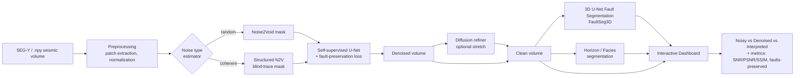

# DeepSeis — Fault-Preserving Self-Supervised Seismic Denoising & Auto-Interpretation

**MC²Plus – Oil India Ltd. – IIT Kharagpur Energy Innovation Challenge 2026**
**Submission Track:** Track 1 — AI-Driven Subsurface Intelligence (Prospecting, Seismic Denoising)

> **One-line pitch:** DeepSeis recovers a clean, interpretable subsurface image from noisy seismic data **without ever needing clean training data** — and unlike ordinary denoisers, it is engineered to *preserve faults*, the exact structural features where hydrocarbons are trapped. On top of the clean image it runs automated fault and horizon detection, turning weeks of manual interpretation into minutes.

---

## 1. Why this wins

| Judging criterion | How DeepSeis scores |
|---|---|
| **Technically impressive** | Self-supervised deep learning (blind-spot networks) + a novel fault-preservation loss + an optional physics-guided diffusion refiner. This is genuine 2024–2026 frontier research, not a wrapper around an off-the-shelf model. |
| **Solves a real problem** | Seismic is the single most expensive input to an exploration decision. Better signal-to-noise = better well placement = fewer dry holes. A dry exploratory well is a total loss of anywhere from a few million dollars onshore to well over $100M offshore. |
| **Direct sponsor relevance** | **ONGC** and **Oil India Ltd.** are both upstream sponsors of this very challenge. This is *their* problem, framed in *their* language. |
| **Actually buildable in a hackathon** | 100% open data (F3 Netherlands + FaultSeg3D synthetic), no proprietary access needed, working demo achievable in 24–48 h. |
| **Deployable narrative** | The architecture ingests standard SEG-Y; it is designed to drop into an existing interpretation workflow (OpendTect / Petrel-style) next quarter, not "someday." |

**The killer insight to lead your pitch with:** *Clean, noise-free seismic ground truth does not exist in the real world.* You can never record "the same shot without noise." This is why classic supervised deep learning fails on field data, and why self-supervised denoising — which learns directly from the raw noisy data itself — is the only approach that generalizes. DeepSeis is built on exactly this principle.

---

## 2. Problem statement (the detailed version)

Raw seismic reflection data is buried in two kinds of noise:

- **Random / incoherent noise** — ambient, electronic, and environmental noise with no trace-to-trace correlation.
- **Coherent noise** — structured artefacts: ground roll (surface waves), linear noise, rig noise, multiples, acquisition footprint. This is the *hard* kind because it looks like signal.

The industry pain is threefold:

1. **No clean labels exist.** Supervised CNN denoisers need noisy↔clean pairs to train. Field seismic has no clean target, so supervised models are trained on synthetic data and then generalize poorly to real surveys.
2. **Naïve denoising destroys the geology.** Aggressive smoothing removes high-frequency content — which is precisely where **faults, pinch-outs, and thin beds** live. Faults are where traps form; smearing them defeats the entire purpose of exploration seismology.
3. **Interpretation is slow and manual.** Even after denoising, a geoscientist manually picks faults and horizons across hundreds of inlines/crosslines — weeks of expert time per survey.

DeepSeis attacks all three: self-supervised training (no clean labels), a fault-preservation objective (geology survives), and automated interpretation (speed).

---

## 3. The core innovation

Three ideas stacked together, in increasing order of ambition. Ship #1 and #2 for the hackathon; #3 is the "wow" stretch goal.

### 3.1 Self-supervised blind-spot denoising (the foundation)
Train a network **directly on the noisy field data** using the *blind-spot* paradigm (Noise2Void / Noise2Self family). The network masks a central sample and is forced to predict it from its noisy neighbourhood. Because the noise at the masked location is statistically independent of its neighbours, the network can only learn to reconstruct the *coherent signal*, not the random noise — so it denoises **without any clean target**.

- For **coherent noise**, extend to **Structured Noise2Void (StructN2V)**: the mask becomes a *blind-trace* or *blind-mask* shaped to the noise's direction/correlation, randomising the coherent noise so the network can't reproduce it.
- **Optional polish:** an "explainable" Jacobian-inspection step to auto-design the noise mask instead of hand-tuning it.

### 3.2 Fault-preservation regularization (the differentiator)
Standard blind-spot loss (MSE on the masked pixel) will happily blur faults. DeepSeis adds a **structure-aware loss term** that penalizes loss of high-frequency, edge-like content along fault-consistent directions (inspired by the DPN2N line of work on preserving high-frequency fault information). Concretely, combine:

```
L_total = L_reconstruction(masked pixels)
        + λ_edge · L_edge_preservation   (gradient/structure similarity vs. input)
        + λ_freq · L_frequency           (preserve high-freq band in F-K domain)
```

This is your defensible technical novelty for the panel: *we denoise and prove we did not erase structure.*

### 3.3 Physics-guided diffusion refiner (stretch / "wow")
As a second stage, a **self-supervised diffusion model** (DDPM-style) refines the denoised output. Diffusion models are the 2025–2026 frontier for seismic processing; a physics/wave-prior constraint keeps the generated detail geologically plausible rather than hallucinated. Present this as the roadmap even if you only get a minimal version running.

### 3.4 Automated interpretation head
Run a **3D U-Net fault segmentation** model (FaultSeg3D architecture) on the *denoised* volume and quantify the improvement vs. running it on the raw noisy volume. This closes the loop: denoising isn't the end goal, *better interpretation* is. Optionally add horizon tracking / facies segmentation using the F3 interpretation labels.

---

## 4. System architecture



**Two-stage pipeline:**
1. **Denoise stage** (self-supervised, trains at demo time on the input itself, or pre-trained + fine-tuned).
2. **Interpret stage** (fault/horizon segmentation on the cleaned volume), with a live A/B comparison proving denoising *improves* interpretation.

---

## 5. Feature breakdown

### MVP (must-have for the demo)
- [ ] Load a 2D seismic line / 3D slice from F3 Netherlands (`.npy`) and/or SEG-Y via `segyio`.
- [ ] Add controllable synthetic noise (so you can show quantitative PSNR/SSIM against a known clean reference).
- [ ] Self-supervised blind-spot denoiser (Noise2Void) trained/fine-tuned on the noisy input.
- [ ] Fault-preservation loss term wired in and toggleable (show the difference on/off — huge demo moment).
- [ ] Fault segmentation (FaultSeg3D pretrained U-Net) run on noisy vs. denoised, with metric delta.
- [ ] **Dashboard**: side-by-side *Noisy | Denoised | Auto-interpreted*, a slider to scrub inlines, and a live metrics panel.

### Stretch (if time allows)
- [ ] Structured Noise2Void for coherent/ground-roll noise.
- [ ] Diffusion refiner stage.
- [ ] Horizon tracking + facies segmentation overlay.
- [ ] F-K spectrum viewer (before/after) to visually prove signal preservation.
- [ ] Export cleaned volume back to SEG-Y for "drop into existing workflow" story.
- [ ] One-click "explain the noise mask" (Jacobian inspection) panel.

---

## 6. Datasets (all free & open)

| Dataset | What it is | Use in DeepSeis | Source |
|---|---|---|---|
| **F3 Netherlands Block** | Public 3D marine survey, North Sea; 651 inlines × 951 crosslines, 4 ms sampling, complex faults + salt diapir. | Real field data for denoising + qualitative interpretation. Available as ready-to-use NumPy (Alaudah et al. 2019 benchmark). | Zenodo (`zenodo.org/records/1471548`); Microsoft `seismic-deeplearning` repo; OpendTect Open Seismic Repository |
| **FaultSeg3D synthetic** | 200 pairs of synthetic 3D seismic volumes + binary fault labels, plus pretrained models. | Train/transfer the fault-segmentation head; also a source of *known clean* volumes to benchmark denoising quantitatively. | GitHub `xinwucwp/faultSeg` |
| **(Optional) Thebe / Kerry / Penobscot** | Additional public field surveys used in fault-detection literature for generalization tests. | Cross-survey generalization demo. | Public seismic repositories |

> **Note on quantitative metrics:** For real field data there is no clean reference, so you evaluate with *no-reference* proxies (local similarity / signal-leakage maps, F-K spectra). To report clean PSNR/SSIM numbers on your slide, use the **synthetic** volumes (FaultSeg3D or self-generated) where a ground truth exists.

---

## 7. Tech stack

**Core ML**
- **Python 3.10+**, **PyTorch** (primary DL framework)
- **NumPy / SciPy** — array & signal ops (F-K transforms, filtering)
- **scikit-image** — SSIM, edge metrics, structure similarity
- **segyio** — SEG-Y read/write (industry-standard seismic I/O)
- **einops** — clean tensor patching for blind-spot masking
- *(Optional)* **Hugging Face `diffusers`** — diffusion refiner
- *(Optional)* **Deepwave / devito** — wave-physics priors for the physics-guided stage

**Model components**
- U-Net / ResU-Net backbone (denoiser)
- 3D U-Net (FaultSeg3D-style) for fault segmentation
- Blind-spot / blind-trace masking layer (custom)

**App / demo layer**
- **Streamlit** (fastest path to a polished demo) **or** **FastAPI + React** (if you want a more product-y UI)
- **Plotly** / **Matplotlib** — seismic image rendering, F-K spectra, metric charts
- **Three.js** *(optional)* — 3D volume visualization for the "wow" factor

**Infra / ops**
- **Docker** — reproducible demo environment
- **CUDA GPU** (Colab / Kaggle free T4 works for the MVP; patch-based training keeps memory low)
- **Weights & Biases** *(optional)* — live training curves during the demo
- **Git / GitHub** — version control, README, reproducibility

---

## 8. Repository structure

```
deepseis/
├── README.md
├── requirements.txt
├── Dockerfile
├── configs/
│   └── default.yaml            # hyperparams, paths, loss weights
├── data/
│   ├── download.py             # fetch F3 + FaultSeg3D
│   └── synth_noise.py          # controllable synthetic noise for metrics
├── deepseis/
│   ├── io/
│   │   ├── segy.py             # segyio wrappers
│   │   └── patches.py          # patch extraction / stitching
│   ├── masking/
│   │   ├── noise2void.py       # random blind-spot mask
│   │   └── struct_n2v.py       # blind-trace / coherent mask
│   ├── models/
│   │   ├── unet.py             # denoiser backbone
│   │   ├── faultseg.py         # 3D U-Net fault segmentation
│   │   └── diffusion.py        # (stretch) refiner
│   ├── losses/
│   │   ├── reconstruction.py
│   │   ├── edge_preserve.py    # fault-preservation term
│   │   └── frequency.py        # F-K high-freq preservation
│   ├── train.py
│   ├── infer.py
│   └── metrics.py              # PSNR, SNR, SSIM, local similarity, fault delta
├── app/
│   └── dashboard.py            # Streamlit demo
└── notebooks/
    └── demo.ipynb              # fallback demo if the app breaks on stage
```

---

## 9. Evaluation metrics

**Denoising (on synthetic, clean available)**
- **PSNR** and **SNR** (dB) — headline improvement numbers.
- **SSIM** — structural fidelity.

**Denoising (on field data, no clean reference)**
- **Local similarity map** between removed-noise and denoised-signal — proves *no signal leakage* (the removed component should look like noise, not geology).
- **F-K spectrum comparison** — confirms high-frequency signal bands survive.

**Fault preservation (the differentiator)**
- **Fault-segmentation delta**: Dice / precision–recall / ROC-AUC of the FaultSeg3D model on *noisy vs. denoised* input — denoised should score meaningfully higher.
- Use the **distance-based fault metric** (FaultSeg3D-plus) for a geologically fair score rather than raw pixel accuracy.

**Interpretation speed**
- Wall-clock: manual picking (hours/inline, cited) vs. automated (seconds/volume).

---

## 10. Build plan — 48-hour hackathon timeline

**Phase 0 — Setup (Hours 0–3)**
- Repo scaffold, `requirements.txt`, Docker/Colab env, GPU confirmed.
- `data/download.py` pulls F3 (`.npy`) + FaultSeg3D + pretrained fault weights.
- Render one clean inline in the notebook — proves the data pipeline end-to-end.

**Phase 1 — Baseline denoiser (Hours 3–12)**
- Implement patch extraction + Noise2Void masking.
- Train the self-supervised U-Net on a noisy inline; get *any* denoising working.
- Add `synth_noise.py` so you can compute PSNR/SSIM against a known clean image.

**Phase 2 — The differentiator (Hours 12–22)**
- Add the fault-preservation loss (`edge_preserve.py` + `frequency.py`), make it toggleable.
- Produce the on/off comparison figure (this is your money shot).

**Phase 3 — Interpretation head (Hours 22–32)**
- Wire in FaultSeg3D pretrained model; run on noisy vs. denoised; compute the metric delta.
- (Stretch) horizon/facies overlay from F3 labels.

**Phase 4 — Dashboard (Hours 32–42)**
- Streamlit app: inline slider, Noisy | Denoised | Interpreted panels, live metrics.
- Polish visuals (seismic red-white-blue colormap, clean typography).

**Phase 5 — Pitch & buffer (Hours 42–48)**
- Record a backup demo video (never live-demo without a fallback).
- Build 6–8 slides; rehearse the 3-minute story; prep Q&A answers (Section 12).

> **Scope discipline:** If you fall behind, cut the diffusion refiner and horizon head first. The non-negotiable core is: *self-supervised denoise + fault-preservation on/off + fault-segmentation delta + a working dashboard.* That alone is a winning demo.

---

## 11. Demo script (what the judges see)

1. **Hook (15s):** "You can never record a seismic shot without noise — so there's no clean data to train on. Here's how we denoise anyway."
2. **Load** a noisy F3 inline. It looks messy.
3. **Denoise** live → clean image appears. Show PSNR/SSIM jump on the synthetic case.
4. **The reveal:** toggle the fault-preservation loss OFF → faults smear. Toggle ON → faults stay crisp. "Ordinary denoisers erase the geology. Ours protects it."
5. **Interpretation:** run fault segmentation on noisy vs. denoised → recall jumps. "Denoising isn't the goal — *finding the trap* is, and we find more of them."
6. **Close (15s):** "Ingests standard SEG-Y, needs no clean labels, drops into ONGC/Oil India's existing workflow. Fewer dry wells, faster interpretation."

---

## 12. Q&A defense (anticipate these)

- **"Does it hallucinate structure?"** — The blind-spot design cannot invent coherent signal it hasn't seen; and our fault-preservation loss is *measured*, not assumed — we show the fault overlay before/after and the local-similarity map proving no signal leakage.
- **"Where's the real training data?"** — There isn't any clean field data, by nature. That's the point: we train self-supervised on the noisy data itself. Synthetic (FaultSeg3D) is only used for quantitative benchmarking.
- **"How is this different from a bandpass/FX-deconvolution filter?"** — Classical filters are global and blur structure; ours is learned, adaptive to the local noise, and explicitly constrained to preserve faults.
- **"Will it generalize to Indian basins (Krishna-Godavari, Assam, Cambay)?"** — Self-supervised training adapts to *each survey's own* noise, which is exactly why it generalizes better than a fixed supervised model. Cross-survey tests (Kerry/Thebe) support this.
- **"Compute cost?"** — Patch-based training runs on a single consumer GPU; inference is fast (seconds per inline), suitable for interactive interpretation.

---

## 13. Impact & business case

- **Dry-well avoidance:** Better fault delineation reduces mis-placed exploratory wells. A single avoided dry hole (millions onshore, $100M+ offshore) dwarfs the cost of the software.
- **Cheaper processing:** No expensive labeled-data campaigns; denoising adapts to each survey automatically.
- **Interpreter productivity:** Automated fault/horizon picking turns weeks of expert labour into minutes, and frees geoscientists for higher-value judgment.
- **Data revival:** Legacy noisy surveys sitting in ONGC/OIL archives become re-usable without re-acquisition (re-shooting a survey costs crores).
- **National relevance:** Directly supports India's domestic exploration and energy-security goals by de-risking upstream investment.

---

## 14. Roadmap beyond the hackathon

1. Structured Noise2Void + auto noise-mask design for field-grade coherent noise.
2. Full physics-guided diffusion refiner (wave-equation prior).
3. Foundation-model direction: one self-supervised backbone for denoising + interpolation + interpretation ("all-in-one" seismic processing).
4. SEG-Y round-trip + plugin for OpendTect / Petrel-style workflows.
5. Pilot on an Indian basin survey with an upstream partner.

---

## 15. Key references (for the report / bibliography)

- Krull, Buchholz, Jug (2019). *Noise2Void — Learning Denoising from Single Noisy Images.* CVPR.
- Batson & Royer (2019). *Noise2Self: Blind Denoising by Self-Supervision.* ICML.
- Lehtinen et al. (2018). *Noise2Noise: Learning Image Restoration without Clean Data.* ICML.
- Birnie, Ravasi, Liu, Alkhalifah (2021). *The potential of self-supervised networks for random noise suppression in seismic data.* Artificial Intelligence in Geosciences, 2, 47–59.
- Birnie & Alkhalifah (2022). *Transfer learning for self-supervised, blind-spot seismic denoising.* Frontiers in Earth Science / arXiv:2209.12210.
- Liu, Birnie, Alkhalifah (2022). *Coherent noise suppression via a self-supervised (Structured Noise2Void) scheme.* EAGE.
- Li, Li, Xiao, Dou et al. (2025). *DPN2N: self-supervised seismic denoising with high-frequency (fault) preservation.* J. Geophysics & Engineering.
- Wu, Liang, Shi, Fomel (2019). *FaultSeg3D: synthetic-data-trained 3D CNN for seismic fault segmentation.* Geophysics, 84(3), IM35–IM45.
- Li, Wu, Zhu, Ding, Wang (2024). *FaultSeg3D plus: evaluating & improving CNN-based fault segmentation.* Geophysics, 89.
- Silva et al. (2019). *Netherlands F3 Dataset: a public dataset for ML in seismic interpretation.* arXiv:1904.00770.
- Durall et al. (2023). *Deep diffusion models for seismic processing.* Computers & Geosciences.

---

## 16. Quick start

```bash
# 1. Environment
git clone <your-repo> && cd deepseis
python -m venv .venv && source .venv/bin/activate
pip install -r requirements.txt      # torch, numpy, scipy, scikit-image, segyio, einops, streamlit, plotly

# 2. Get data
python data/download.py              # F3 Netherlands (.npy) + FaultSeg3D synthetic + pretrained fault weights

# 3. Train the self-supervised denoiser on one inline
python -m deepseis.train --config configs/default.yaml

# 4. Run inference + interpretation
python -m deepseis.infer --input data/f3_inline_400.npy

# 5. Launch the demo
streamlit run app/dashboard.py
```

---

*Built for the MC²Plus – Oil India Ltd. – IIT Kharagpur Energy Innovation Challenge 2026. Track 1: AI-Driven Subsurface Intelligence.*
